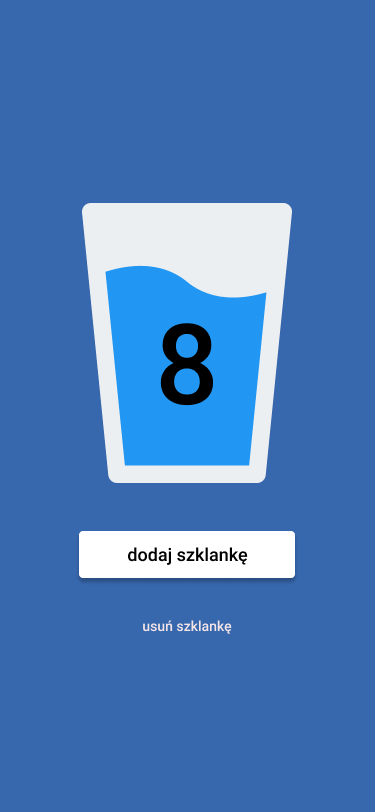
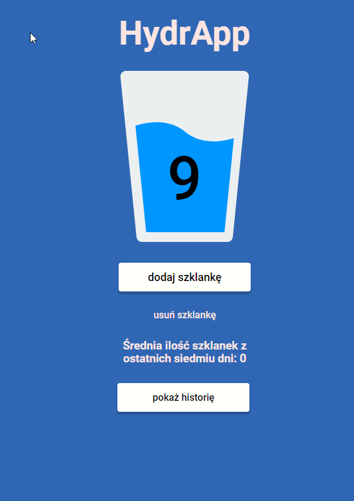
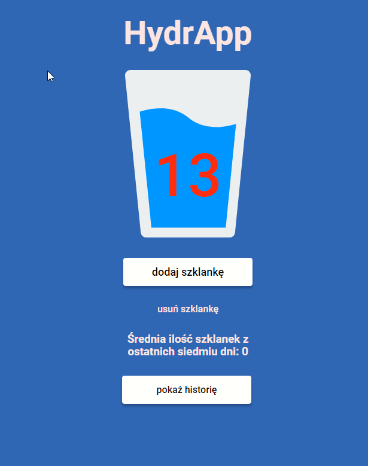
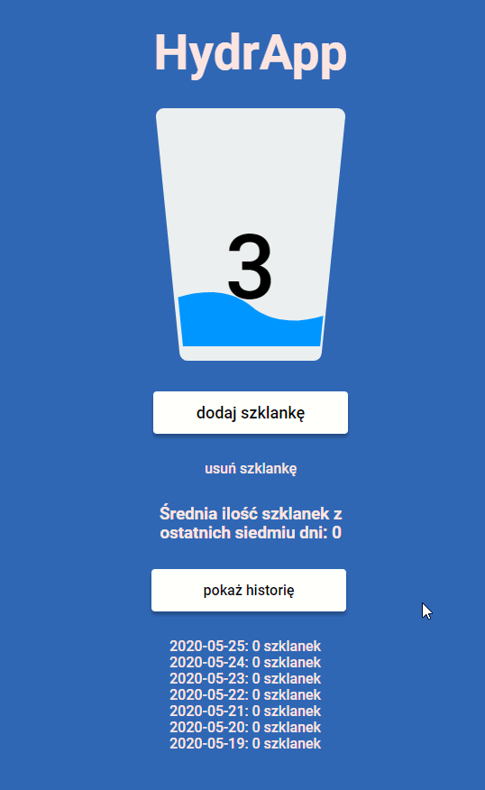

# HydrApp

## WTF: Co ten frontend

### live demo

[HydrApp Live Demo](https://marcinkisiel.github.io/wtf-hydrapp-pwa/)

### description

**HydrApp** is a simple Progressive Web App made as a homework in **_[WTF: Co ten frontend](https://cotenfrontend.pl/)_** training program by **Maciek Korsan**.
Its purpose is to count the number of glasses of water drunk with a daily limit and to remember the number of glasses using the **_localStorage_** mechanism.

### current status

unfinished

### implementation time

December 2019 - till now

### technologies

JavaScript, PWA, HTML, CSS

### tools used

Sass (SCSS), Webpack, Gulp

### design

Maciej Korsan
 

### screenshots

### contact

**Marcin Kisiel**:
 
[kisiel.marcin@gmail.com](mailto:kisiel.marcin@gmail.com)
 
[LinkedIn](https://www.linkedin.com/in/marcin-kisiel/)
 
[GitHub](https://github.com/marcinkisiel)
 
